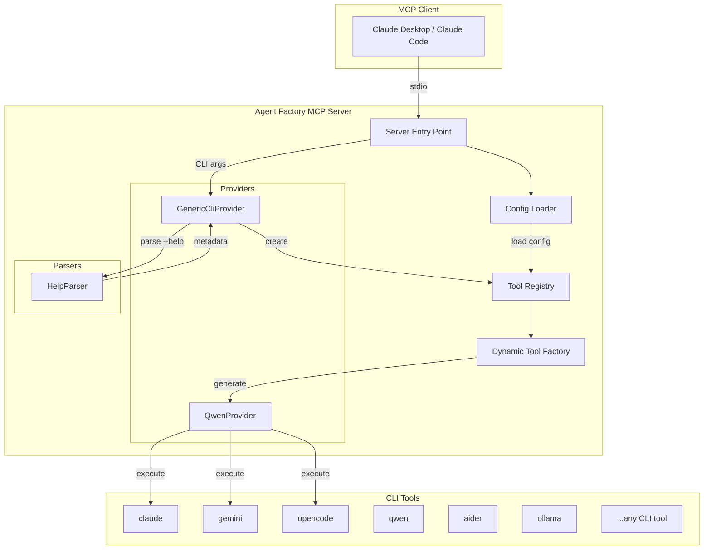
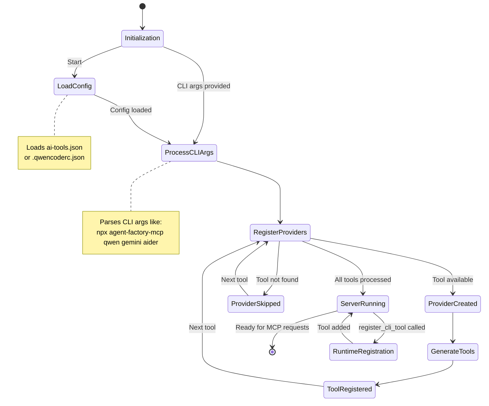

# Agent Factory MCP

<div align="center">

[](https://opensource.org/licenses/MIT)
[](https://github.com/utenadev/agent-factory-mcp)

</div>

> **AI エージェントツール**のための汎用 Model Context Protocol (MCP) サーバーです。**AI CLI ツール** (Qwen, Ollama, Aider など) を自動検出し、MCP ツールとして登録することで、ペルソナ設定を持った AI エージェントへと変換します。

## 特徴

- **自動検出 (Auto-Discovery)**: `PATH` 内の互換性のある AI CLI ツール（安全なホワイトリストに基づく）を自動的に検出し、MCP ツールとして登録します。
- **セッション管理**: `sessionId` パラメータを使用して、複数回の呼び出し間で会話を継続できます。
- **ヘルプ出力解析**: CLI の `--help` 出力を解析してツールのメタデータを生成します。
- **ゼロコード登録**: 設定ファイルやコマンドライン引数を使って簡単にツールを登録できます。
- **ペルソナサポート**: システムプロンプトを設定して、特定の役割（ペルソナ）を持った AI エージェントを作成できます。
- **ツール単位サーバー**: 各 AI ツールを個別の MCP サーバーとして実行し、リソース管理を最適化します。
- **マルチプロバイダー**: 複数の AI ツール（Claude, Gemini, Qwen など）を同時に使用できます。
- **ランタイム登録**: MCP プロトコル経由で動的に新しいツールを追加できます。

## アーキテクチャ



## 状態遷移



## インストール

```bash
# グローバルインストール（npm または bun）
npm install -g agent-factory-mcp
# または
bun install -g agent-factory-mcp

# インストールせずに使用
bunx agent-factory-mcp
```

## 設定

### 方法 1: コマンドライン引数（ツール単位サーバー）

各 AI ツールを個別の MCP サーバーとして実行：

```bash
# 特定のツールのみで実行
agent-factory-mcp claude     # Claude Code のみ
agent-factory-mcp gemini     # Gemini CLI のみ
agent-factory-mcp opencode   # OpenCode のみ

# 複数のツールを1つのサーバーで登録
npx agent-factory-mcp qwen gemini aider
```

**Claude Desktop 設定（ツール単位セットアップ）:**
```json
{
  "mcpServers": {
    "claude": {
      "command": "agent-factory-mcp",
      "args": ["claude"]
    },
    "gemini": {
      "command": "agent-factory-mcp",
      "args": ["gemini"]
    },
    "qwen": {
      "command": "agent-factory-mcp",
      "args": ["qwen"]
    }
  }
}
```

### 方法 2: 設定ファイル

プロジェクトルートに `ai-tools.json` を作成します。**設定ファイルが存在しない場合**、サーバーは起動時に `PATH` から互換性のある CLI ツール（`qwen`, `opencode`, `gemini` など）を**自動検出**し、このファイルに追加します。

> **注意**: 自動検出は設定ファイルが見つからない場合にのみ実行されます。新しいツールのインストールやバージョンの更新後に検出を再実行したい場合は、`ai-tools.json` ファイルを削除してサーバーを再起動してください。

```json
{
  "$schema": "./schema.json",
  "version": "1.0",
  "tools": [
    {
      "command": "qwen",
      "alias": "code-reviewer",
      "description": "セキュリティとパフォーマンスに重点を置くコードレビューの専門家",
      "systemPrompt": "あなたはシニアコードレビュアーです。セキュリティの脆弱性、パフォーマンスの問題、保守性に焦点を当ててください。"
    },
    {
      "command": "qwen",
      "alias": "doc-writer",
      "description": "技術ドキュメントのスペシャリスト",
      "systemPrompt": "あなたは開発者向けに明確で簡潔な技術ドキュメントを作成します。"
    }
  ]
}
```

### 方法 3: ランタイム登録

`register_cli_tool` MCP ツールを使用します：

```
register_cli_tool({
  command: "ollama",
  alias: "local-llm",
  description: "Ollama 経由でローカル LLM モデルを実行",
  systemPrompt: "あなたはローカルで動作する役立つ AI アシスタントです。",
  persist: true
})
```

## MCP クライアントのセットアップ

### Claude Desktop

Claude Desktop の設定ファイルに追加します：

**macOS**: `~/Library/Application Support/Claude/claude_desktop_config.json`
**Windows**: `%APPDATA%\Claude\claude_desktop_config.json`
**Linux**: `~/.config/claude/claude_desktop_config.json`

**オプション 1: ツール単位サーバー（リソース管理に推奨）**
```json
{
  "mcpServers": {
    "claude": {
      "command": "agent-factory-mcp",
      "args": ["claude"]
    },
    "gemini": {
      "command": "agent-factory-mcp",
      "args": ["gemini"]
    },
    "qwen": {
      "command": "agent-factory-mcp",
      "args": ["qwen"]
    }
  }
}
```

**オプション 2: すべてのツールを1つのサーバーで**
```json
{
  "mcpServers": {
    "agent-factory": {
      "command": "agent-factory-mcp",
      "args": ["claude", "gemini", "qwen"]
    }
  }
}
```

### Claude Code CLI

```bash
claude mcp add agent-factory -- npx agent-factory-mcp qwen gemini aider
```

## クイックスタート: AI エージェントツールを使う

このガイドでは、AI エージェントツール（Claude CLI、Gemini CLI、OpenCode など）をセットアップして使用するまでの手順を説明します。

### ステップ 1: AI エージェント CLI ツールをインストール

まず、1つ以上の AI エージェント CLI ツールをインストールします：

```bash
# Claude CLI (Anthropic の公式 CLI)
npm install -g @anthropic-ai/claude-cli

# Gemini CLI (Google の AI CLI)
npm install -g gemini-cli

# OpenCode (別の AI コーディングアシスタント)
npm install -g opencode
```

### ステップ 2: MCP クライアントを設定

Claude Desktop の設定ファイルに AI エージェントツールを追加します：

**macOS**: `~/Library/Application Support/Claude/claude_desktop_config.json`

```json
{
  "mcpServers": {
    "claude": {
      "command": "agent-factory-mcp",
      "args": ["claude"]
    },
    "gemini": {
      "command": "agent-factory-mcp",
      "args": ["gemini"]
    },
    "opencode": {
      "command": "agent-factory-mcp",
      "args": ["opencode"]
    }
  }
}
```

### ステップ 3: Claude Desktop を再起動

Claude Desktop を終了して再起動し、新しい MCP サーバー設定を読み込みます。

### ステップ 4: AI エージェントツールを使用

これで Claude から直接 AI エージェントツールを使用できるようになります：

```
# Claude CLI を使ってコードを書く
Use claude to write a function that sorts an array

# Gemini CLI を使ってテキストを分析
Use gemini to summarize this document

# OpenCode を使ってコードをリファクタリング
Use opencode to refactor this function to be more efficient

# 会話を継続
Use claude with session "latest" to continue our previous discussion
```

### ステップ 5: (オプション) ツールをカスタマイズ

プロジェクトルートに `ai-tools.json` を作成して、ツールの動作をカスタマイズします：

```json
{
  "$schema": "./schema.json",
  "version": "1.0",
  "tools": [
    {
      "command": "claude",
      "alias": "code-expert",
      "description": "コードの作成とレビューの専門家",
      "systemPrompt": "あなたはシニアソフトウェアエンジニアです。 clean で効率的なコードを書き、適切なエラーハンドリングを行ってください。",
      "defaultArgs": {
        "model": "claude-sonnet-4-20250514"
      }
    },
    {
      "command": "gemini",
      "alias": "text-analyzer",
      "description": "テキスト分析と要約のスペシャリスト",
      "systemPrompt": "あなたはテキスト分析の専門家です。簡潔な要約と洞察を提供してください。"
    }
  ]
}
```

### ステップ 6: (オプション) 環境変数を設定

API キーやその他の環境変数が必要なツールの場合：

```json
{
  "tools": [
    {
      "command": "openai",
      "env": {
        "OPENAI_API_KEY": "sk-your-api-key-here",
        "OPENAI_BASE_URL": "https://api.openai.com/v1"
      },
      "defaultArgs": {
        "model": "gpt-4"
      }
    }
  ]
}
```

> **セキュリティ上の注意**: API キーをバージョン管理にコミットしないでください。環境変数または安全なシークレットマネージャーを使用してください。

### セッション管理の例

複数回の呼び出し間で会話を継続：

```
# 最初のメッセージ
Use claude: My name is Ken and I'm working on a TypeScript project

# 同じセッションでフォローアップ
Use claude with sessionId "latest": What's my name and what project am I working on?
```

## 使用例

```bash
claude mcp add agent-factory -- npx agent-factory-mcp qwen gemini aider
```

## 使用例

### セッション管理

複数回の呼び出し間で会話を継続：

```javascript
// 最初の呼び出し - 新しいセッション
await tool.execute({
  prompt: "私の名前はケンです。覚えておいてください。"
});

// 2回目の呼び出し - セッションを再開
await tool.execute({
  sessionId: "latest",  // または特定のセッションID
  prompt: "私の名前は何ですか？"
});
// レスポンス: "あなたの名前はケンです。" ✓ コンテキストが維持されている
```

### 専門エージェントの使用

```bash
# セキュリティ重視のコードレビュー
"Use code-reviewer to analyze this file for security issues"

# ドキュメント生成
"Ask doc-writer to generate API docs for this module"

# 一般的な AI アシスタンス
"Use ask-qwen to explain this code"
```

### 複数の AI ツールの使用

```bash
# タスクに応じて異なる AI を使用
"Use gemini-vision to analyze this screenshot"
"Use aider to refactor this function"
"Use qwen to review the changes"
```

## 設定スキーマ

完全な設定スキーマについては `schema.json` を参照してください：

| フィールド | 型 | 必須 | 説明 |
|-------|------|----------|-------------|
| `command` | string | ✅ | 登録する CLI コマンド (例: "claude", "gemini", "opencode") |
| `enabled` | boolean | ❌ | ツールが有効かどうか (デフォルト: true) |
| `alias` | string | ❌ | ツールのカスタム名 (デフォルト: "ask-{command}") |
| `description` | string | ❌ | ツールのカスタム説明 |
| `systemPrompt` | string | ❌ | AI ペルソナ用のシステムプロンプト |
| `providerType` | string | ❌ | プロバイダータイプ: "cli-auto" または "custom" (デフォルト: "cli-auto") |
| `parserStrategy` | string | ❌ | ヘルプパーサー戦略: "gnu", "go", "custom" (デフォルト: "gnu") |
| `subcommands` | array | ❌ | 登録するサブコマンド |
| `defaultArgs` | object | ❌ | 引数のデフォルト値 |
| `env` | object | ❌ | ツール実行時の環境変数 (API キーなど) |
| `version` | string | ❌ | 自動検出されたツールバージョン |

## 開発

```bash
# 依存関係のインストール
bun install

# ビルド
bun run build

# テスト実行
bun test

# 型チェック
bun run type-check

# リント
bun run lint

# フォーマット
bun run format

# 自動検出の手動実行
bun run auto-discover
```

## プロジェクト構造

```
agent-factory-mcp/
├── src/
│   ├── index.ts              # サーバーエントリーポイント
│   ├── constants.ts          # 定数
│   ├── providers/            # プロバイダー実装
│   │   ├── base-cli.provider.ts
│   │   ├── generic-cli.provider.ts
│   │   └── qwen.provider.ts
│   ├── tools/                # ツールレジストリとファクトリ
│   │   ├── registry.ts
│   │   ├── dynamic-tool-factory.ts
│   │   └── simple-tools.ts
│   ├── parsers/              # CLI ヘルプパーサー
│   │   └── help-parser.ts
│   ├── types/                # TypeScript 型定義
│   │   └── cli-metadata.ts
│   └── utils/                # ユーティリティ
│       ├── configLoader.ts
│       ├── commandExecutor.ts
│       ├── logger.ts
│       └── progressManager.ts
├── test/                     # テストファイル
├── ai-tools.json.example     # 設定例
├── schema.json               # JSON スキーマ
└── Taskfile.yml              # タスクランナー設定
```

## 貢献

プルリクエストを歓迎します！

## 謝辞

このプロジェクトは [jamubc/gemini-mcp-tool](https://github.com/jamubc/gemini-mcp-tool) にインスピレーションを受けています。

## ライセンス

MIT License - 詳細は [LICENSE](LICENSE) を参照してください。