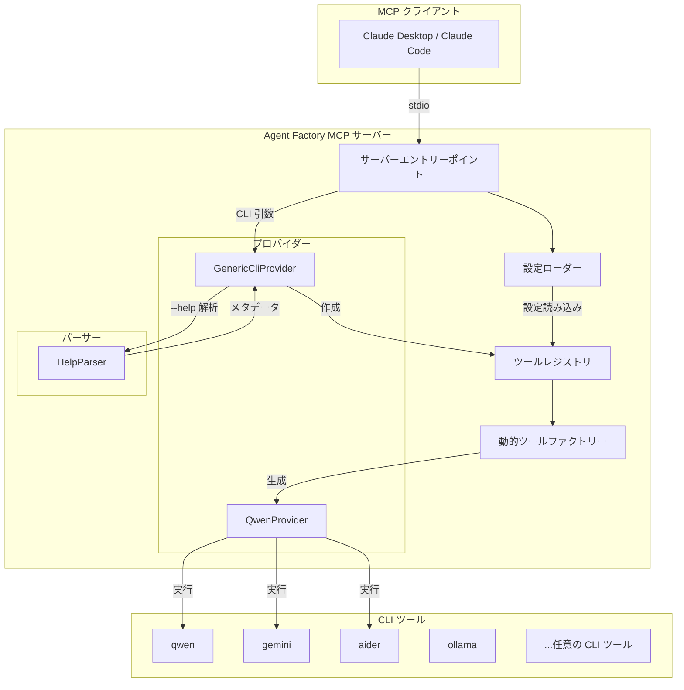
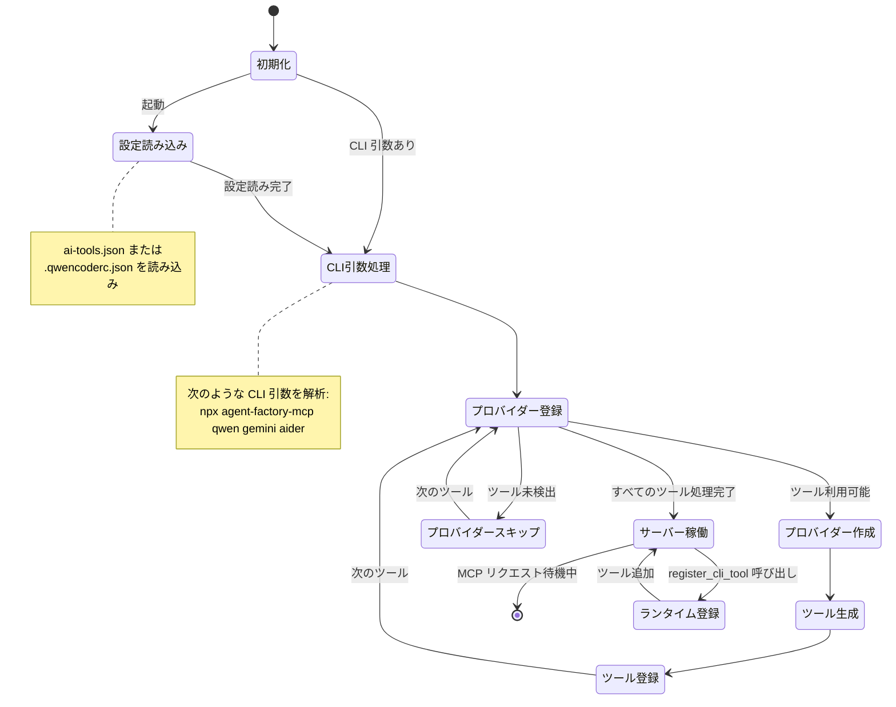

# Agent Factory MCP

<div align="center">

[](https://opensource.org/licenses/MIT)
[](https://github.com/utenadev/agent-factory-mcp)

</div>

> CLI ツールを自動発見して MCP ツールとして登録する汎用モデルコンテキストプロトコル（MCP）サーバー。任意の CLI ツール（Qwen、Ollama、Aider など）をペルソナ設定付きの AI エージェントに変換できます。

## 特徴

- **自動発見**: CLI の `--help` 出力を自動的に解析してツールメタデータを生成
- **ゼロコード登録**: 設定ファイルまたはコマンドライン引数でツールを登録
- **ペルソナサポート**: システムプロンプトを設定して専門化された AI エージェントを作成
- **マルチプロバイダー**: 複数の AI ツールを同時に使用（Qwen、Gemini、Aider など）
- **ランタイム登録**: MCP プロトコル経由で新しいツールを動的に追加

## アーキテクチャ



## 状態遷移



## インストール

```bash
# npm 経由でインストール
npm install -g agent-factory-mcp

# または npx でインストールなしで使用
npx agent-factory-mcp

# または bun で使用
bunx agent-factory-mcp
```

## 設定

### 方法 1: コマンドライン引数

CLI 引数で直接ツールを登録：

```bash
npx agent-factory-mcp qwen gemini aider
```

### 方法 2: 設定ファイル

プロジェクトルートに `ai-tools.json` を作成：

```json
{
  "$schema": "./schema.json",
  "version": "1.0",
  "tools": [
    {
      "command": "qwen",
      "alias": "code-reviewer",
      "description": "セキュリティとパフォーマンスに焦点を当てたコードレビューエキスパート",
      "systemPrompt": "あなたはシニアコードレビュアーです。セキュリティ脆弱性、パフォーマンス問題、保守性に焦点を当ててください。"
    },
    {
      "command": "qwen",
      "alias": "doc-writer",
      "description": "技術ドキュメントスペシャリスト",
      "systemPrompt": "あなたは開発者向けに明確で簡潔な技術ドキュメントを書きます。"
    }
  ]
}
```

### 方法 3: ランタイム登録

`register_cli_tool` MCP ツールを使用：

```
register_cli_tool({
  command: "ollama",
  alias: "local-llm",
  description: "Ollama経由でローカルLLMモデルを実行",
  systemPrompt: "あなたはローカルで実行されている役立つAIアシスタントです。",
  persist: true
})
```

## MCP クライアント設定

### Claude Desktop

Claude Desktop 設定ファイルに追加：

**macOS**: `~/Library/Application Support/Claude/claude_desktop_config.json`
**Windows**: `%APPDATA%\Claude\claude_desktop_config.json`
**Linux**: `~/.config/claude/claude_desktop_config.json`

```json
{
  "mcpServers": {
    "agent-factory": {
      "command": "npx",
      "args": ["agent-factory-mcp", "qwen", "gemini", "aider"]
    }
  }
}
```

### Claude Code CLI

```bash
claude mcp add agent-factory -- npx agent-factory-mcp qwen gemini aider
```

## 使用例

### 専門化されたエージェントの使用

```bash
# セキュリティ重視のコードレビュー
"code-reviewerを使ってこのファイルのセキュリティ問題を分析してください"

# ドキュメント生成
"doc-writerにこのモジュールのAPIドキュメントを生成させます"

# 一般的なAI支援
"ask-qwenを使ってこのコードを説明してください"
```

### 複数のAIツール

```bash
# タスクに応じて異なるAIを使用
"gemini-visionを使ってこのスクリーンショットを分析してください"
"aiderを使ってこの関数をリファクタリングしてください"
"qwenを使って変更点をレビューしてください"
```

## 設定スキーマ

完全な設定スキーマは `schema.json` を参照してください：

| フィールド | 型 | 必須 | 説明 |
|-----------|------|------|------|
| `command` | string | ✅ | 登録するCLIコマンド（例: "qwen", "ollama"） |
| `enabled` | boolean | ❌ | ツールが有効かどうか（デフォルト: true） |
| `alias` | string | ❌ | カスタムツール名（デフォルト: "ask-{command}"） |
| `description` | string | ❌ | カスタムツール説明 |
| `systemPrompt` | string | ❌ | AIペルソナ用のシステムプロンプト |
| `providerType` | string | ❌ | プロバイダータイプ: "cli-auto" または "custom" |
| `defaultArgs` | object | ❌ | デフォルト引数値 |

## 開発

```bash
# 依存関係をインストール
bun install

# ビルド
bun run build

# テスト実行
bun test

# 型チェック
bun run type-check

# リント
bun run lint

# フォーマット
bun run format
```

## プロジェクト構造

```
agent-factory-mcp/
├── src/
│   ├── index.ts              # サーバーエントリーポイント
│   ├── constants.ts          # 定数
│   ├── providers/            # プロバイダー実装
│   │   ├── base-cli.provider.ts
│   │   ├── generic-cli.provider.ts
│   │   └── qwen.provider.ts
│   ├── tools/                # ツールレジストリとファクトリー
│   │   ├── registry.ts
│   │   ├── dynamic-tool-factory.ts
│   │   └── simple-tools.ts
│   ├── parsers/              # CLIヘルプパーサー
│   │   └── help-parser.ts
│   ├── types/                # TypeScript型定義
│   │   └── cli-metadata.ts
│   └── utils/                # ユーティリティ
│       ├── configLoader.ts
│       ├── commandExecutor.ts
│       ├── logger.ts
│       └── progressManager.ts
├── test/                     # テストファイル
├── ai-tools.json.example     # 設定例
├── schema.json               # JSONスキーマ
└── Taskfile.yml              # タスクランナー設定
```

## コントリビューション

貢献大歓迎です！お気軽にプルリクエストを送信してください。

## ライセンス

MIT ライセンス - 詳細は [LICENSE](LICENSE) を参照してください。
