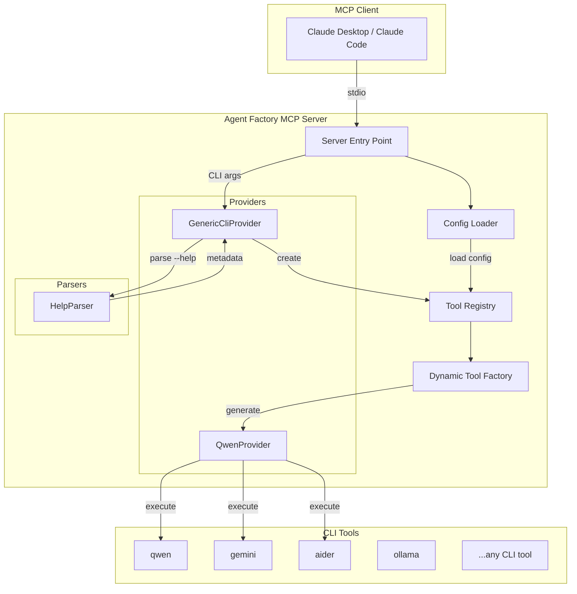
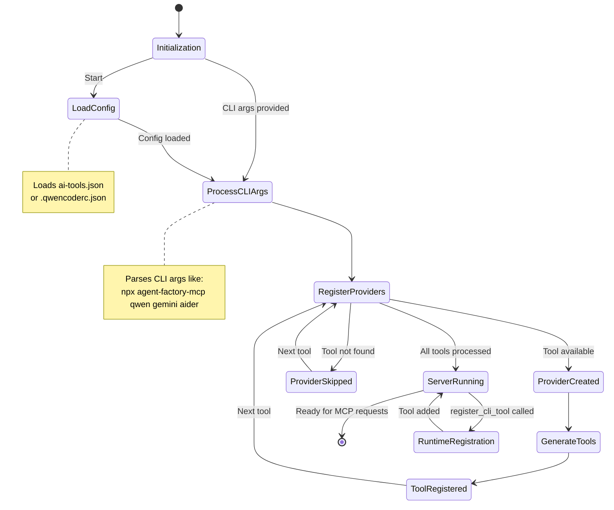

# Agent Factory MCP

<div align="center">

[](https://opensource.org/licenses/MIT)
[](https://github.com/utenadev/agent-factory-mcp)

</div>

> A universal Model Context Protocol (MCP) server that automatically discovers and registers CLI tools as MCP tools. Transform any CLI tool (Qwen, Ollama, Aider, etc.) into an AI-powered agent with persona configuration.

## Features

- **Auto-Discovery**: Automatically parse CLI `--help` output to generate tool metadata
- **Zero-Code Registration**: Register tools via config file or command-line arguments
- **Persona Support**: Configure system prompts to create specialized AI agents
- **Multi-Provider**: Use multiple AI tools simultaneously (Qwen, Gemini, Aider, etc.)
- **Runtime Registration**: Add new tools dynamically via MCP protocol

## Architecture



## State Transition



## Installation

```bash
# Install via npm
npm install -g agent-factory-mcp

# Or use with npx without installation
npx agent-factory-mcp

# Or use with bun
bunx agent-factory-mcp
```

## Configuration

### Method 1: Command-Line Arguments

Register tools directly via CLI arguments:

```bash
npx agent-factory-mcp qwen gemini aider
```

### Method 2: Configuration File

Create `ai-tools.json` in your project root:

```json
{
  "$schema": "./schema.json",
  "version": "1.0",
  "tools": [
    {
      "command": "qwen",
      "alias": "code-reviewer",
      "description": "Code review expert focusing on security and performance",
      "systemPrompt": "You are a senior code reviewer. Focus on security vulnerabilities, performance issues, and maintainability."
    },
    {
      "command": "qwen",
      "alias": "doc-writer",
      "description": "Technical documentation specialist",
      "systemPrompt": "You write clear, concise technical documentation for developers."
    }
  ]
}
```

### Method 3: Runtime Registration

Use the `register_cli_tool` MCP tool:

```
register_cli_tool({
  command: "ollama",
  alias: "local-llm",
  description: "Run local LLM models via Ollama",
  systemPrompt: "You are a helpful AI assistant running locally.",
  persist: true
})
```

## MCP Client Setup

### Claude Desktop

Add to your Claude Desktop config:

**macOS**: `~/Library/Application Support/Claude/claude_desktop_config.json`
**Windows**: `%APPDATA%\Claude\claude_desktop_config.json`
**Linux**: `~/.config/claude/claude_desktop_config.json`

```json
{
  "mcpServers": {
    "agent-factory": {
      "command": "npx",
      "args": ["agent-factory-mcp", "qwen", "gemini", "aider"]
    }
  }
}
```

### Claude Code CLI

```bash
claude mcp add agent-factory -- npx agent-factory-mcp qwen gemini aider
```

## Usage Examples

### Using Specialized Agents

```bash
# Code review with security focus
"Use code-reviewer to analyze this file for security issues"

# Documentation generation
"Ask doc-writer to generate API docs for this module"

# General AI assistance
"Use ask-qwen to explain this code"
```

### Multiple AI Tools

```bash
# Use different AIs for different tasks
"Use gemini-vision to analyze this screenshot"
"Use aider to refactor this function"
"Use qwen to review the changes"
```

## Configuration Schema

See `schema.json` for the full configuration schema:

| Field | Type | Required | Description |
|-------|------|----------|-------------|
| `command` | string | ✅ | CLI command to register (e.g., "qwen", "ollama") |
| `enabled` | boolean | ❌ | Whether the tool is enabled (default: true) |
| `alias` | string | ❌ | Custom tool name (default: "ask-{command}") |
| `description` | string | ❌ | Custom tool description |
| `systemPrompt` | string | ❌ | System prompt for AI persona |
| `providerType` | string | ❌ | Provider type: "cli-auto" or "custom" |
| `defaultArgs` | object | ❌ | Default argument values |

## Development

```bash
# Install dependencies
bun install

# Build
bun run build

# Run tests
bun test

# Type check
bun run type-check

# Lint
bun run lint

# Format
bun run format
```

## Project Structure

```
agent-factory-mcp/
├── src/
│   ├── index.ts              # Server entry point
│   ├── constants.ts          # Constants
│   ├── providers/            # Provider implementations
│   │   ├── base-cli.provider.ts
│   │   ├── generic-cli.provider.ts
│   │   └── qwen.provider.ts
│   ├── tools/                # Tool registry and factory
│   │   ├── registry.ts
│   │   ├── dynamic-tool-factory.ts
│   │   └── simple-tools.ts
│   ├── parsers/              # CLI help parser
│   │   └── help-parser.ts
│   ├── types/                # TypeScript types
│   │   └── cli-metadata.ts
│   └── utils/                # Utilities
│       ├── configLoader.ts
│       ├── commandExecutor.ts
│       ├── logger.ts
│       └── progressManager.ts
├── test/                     # Test files
├── ai-tools.json.example     # Example configuration
├── schema.json               # JSON schema
└── Taskfile.yml              # Task runner configuration
```

## Contributing

Contributions are welcome! Please feel free to submit a Pull Request.

## License

MIT License - see [LICENSE](LICENSE) for details.
