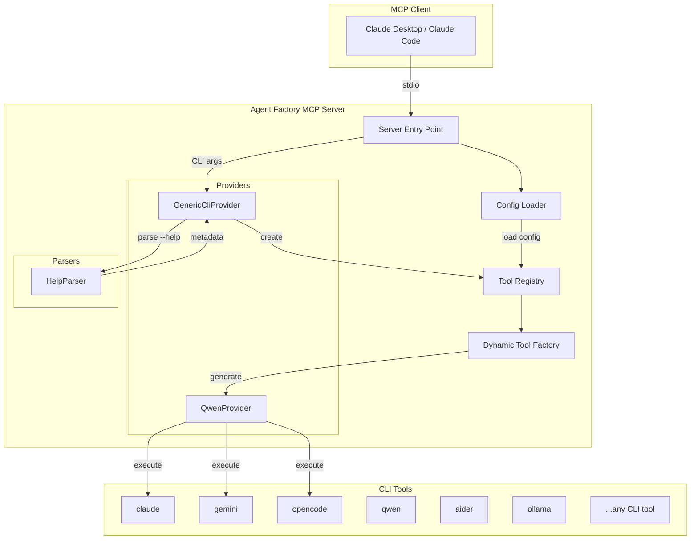
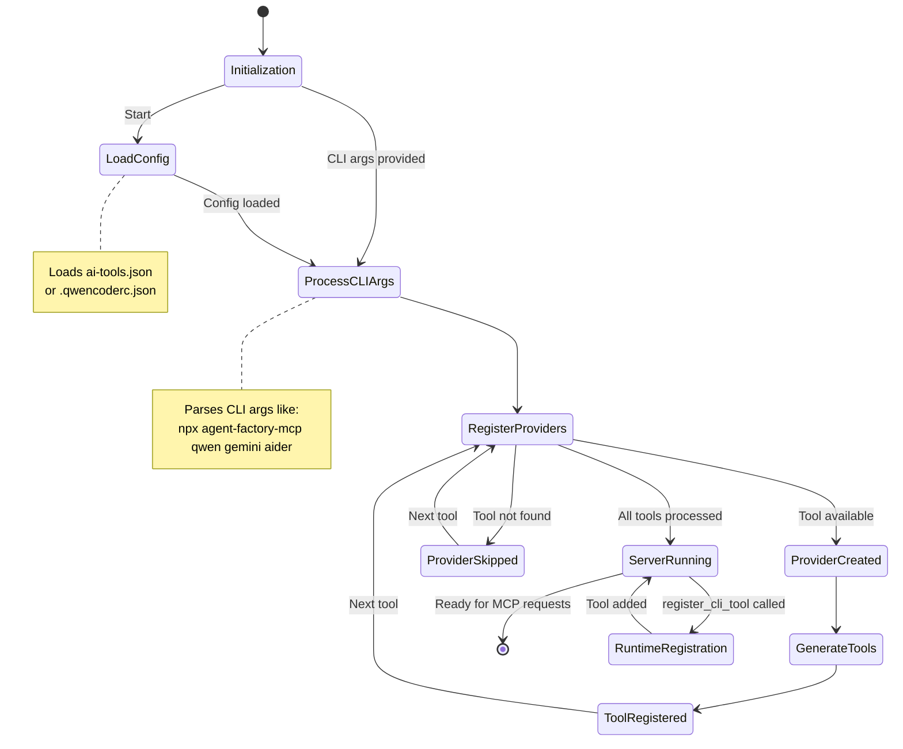

# Agent Factory MCP

<div align="center">

[](https://opensource.org/licenses/MIT)
[](https://github.com/utenadev/agent-factory-mcp)

</div>

> A universal Model Context Protocol (MCP) server for **AI Agent tools**. It automatically discovers and registers **AI CLI tools** (Qwen, Ollama, Aider, etc.) as MCP tools, transforming them into AI-powered agents with persona configuration.

## Features

- **Auto-Discovery**: Automatically detect compatible AI CLI tools (from a safety whitelist) in `PATH` and register them as MCP tools
- **Session Management**: Continue conversations across multiple calls using `sessionId` parameter
- **Help Output Parsing**: Parse CLI `--help` output to generate tool metadata
- **Zero-Code Registration**: Register tools via config file or command-line arguments
- **Persona Support**: Configure system prompts to create specialized AI agents
- **Per-Tool Server**: Run each AI tool as a separate MCP server for better resource management
- **Multi-Provider**: Use multiple AI tools simultaneously (Claude, Gemini, Qwen, etc.)
- **Runtime Registration**: Add new tools dynamically via MCP protocol

## Architecture



## State Transition



## Installation

```bash
# Install globally (via npm or bun)
npm install -g agent-factory-mcp
# or
bun install -g agent-factory-mcp

# Or use without installation
bunx agent-factory-mcp
```

## Configuration

### Method 1: Command-Line Arguments (Per-Tool Server)

Run each AI tool as a separate MCP server:

```bash
# Run with specific tool only
agent-factory-mcp claude     # Claude Code only
agent-factory-mcp gemini     # Gemini CLI only
agent-factory-mcp opencode   # OpenCode only

# Or register multiple tools in one server
npx agent-factory-mcp qwen gemini aider
```

**Claude Desktop config (per-tool setup):**
```json
{
  "mcpServers": {
    "claude": {
      "command": "agent-factory-mcp",
      "args": ["claude"]
    },
    "gemini": {
      "command": "agent-factory-mcp",
      "args": ["gemini"]
    },
    "opencode": {
      "command": "agent-factory-mcp",
      "args": ["opencode"]
    }
  }
}
```

### Method 2: Configuration File

Create `ai-tools.json` in your project root. The server will also **auto-discover** compatible CLI tools (like `qwen`, `opencode`, `gemini`) from your `PATH` and add them to this file on startup **if no configuration file exists**.

> **Note**: Auto-discovery only runs when no configuration file is found. To re-run discovery (e.g., after installing a new tool or updating a tool version), simply delete the `ai-tools.json` file and restart the server.

```json
{
  "$schema": "./schema.json",
  "version": "1.0",
  "tools": [
    {
      "command": "qwen",
      "alias": "code-reviewer",
      "description": "Code review expert focusing on security and performance",
      "systemPrompt": "You are a senior code reviewer. Focus on security vulnerabilities, performance issues, and maintainability."
    },
    {
      "command": "qwen",
      "alias": "doc-writer",
      "description": "Technical documentation specialist",
      "systemPrompt": "You write clear, concise technical documentation for developers."
    }
  ]
}
```

### Method 3: Runtime Registration

Use the `register_cli_tool` MCP tool:

```
register_cli_tool({
  command: "ollama",
  alias: "local-llm",
  description: "Run local LLM models via Ollama",
  systemPrompt: "You are a helpful AI assistant running locally.",
  persist: true
})
```

## MCP Client Setup

### Claude Desktop

Add to your Claude Desktop config:

**macOS**: `~/Library/Application Support/Claude/claude_desktop_config.json`
**Windows**: `%APPDATA%\Claude\claude_desktop_config.json`
**Linux**: `~/.config/claude/claude_desktop_config.json`

**Option 1: Per-tool servers (recommended for better resource management)**
```json
{
  "mcpServers": {
    "claude": {
      "command": "agent-factory-mcp",
      "args": ["claude"]
    },
    "gemini": {
      "command": "agent-factory-mcp",
      "args": ["gemini"]
    },
    "qwen": {
      "command": "agent-factory-mcp",
      "args": ["qwen"]
    }
  }
}
```

**Option 2: All tools in one server**
```json
{
  "mcpServers": {
    "agent-factory": {
      "command": "agent-factory-mcp",
      "args": ["claude", "gemini", "qwen"]
    }
  }
}
```

### Claude Code CLI

```bash
claude mcp add agent-factory -- npx agent-factory-mcp qwen gemini aider
```

## Quick Start: Using AI Agent Tools

This guide shows you how to set up and use AI Agent tools (like Claude CLI, Gemini CLI, OpenCode) step by step.

### Step 1: Install an AI Agent CLI Tool

First, install one or more AI Agent CLI tools:

```bash
# Claude CLI (Anthropic's official CLI)
npm install -g @anthropic-ai/claude-cli

# Gemini CLI (Google's AI CLI)
npm install -g gemini-cli

# OpenCode (Another AI coding assistant)
npm install -g opencode
```

### Step 2: Configure Your MCP Client

Add the AI Agent tool to your Claude Desktop config:

**macOS**: `~/Library/Application Support/Claude/claude_desktop_config.json`

```json
{
  "mcpServers": {
    "claude": {
      "command": "agent-factory-mcp",
      "args": ["claude"]
    },
    "gemini": {
      "command": "agent-factory-mcp",
      "args": ["gemini"]
    },
    "opencode": {
      "command": "agent-factory-mcp",
      "args": ["opencode"]
    }
  }
}
```

### Step 3: Restart Claude Desktop

Quit and restart Claude Desktop to load the new MCP server configuration.

### Step 4: Use the AI Agent Tools

Now you can use the AI Agent tools directly in Claude:

```
# Use Claude CLI to write code
Use claude to write a function that sorts an array

# Use Gemini CLI to analyze text
Use gemini to summarize this document

# Use OpenCode to refactor code
Use opencode to refactor this function to be more efficient

# Continue a conversation
Use claude with session "latest" to continue our previous discussion
```

### Step 5: (Optional) Customize Your Tools

Create `ai-tools.json` in your project root to customize tool behavior:

```json
{
  "$schema": "./schema.json",
  "version": "1.0",
  "tools": [
    {
      "command": "claude",
      "alias": "code-expert",
      "description": "Expert at writing and reviewing code",
      "systemPrompt": "You are a senior software engineer. Write clean, efficient code with proper error handling.",
      "defaultArgs": {
        "model": "claude-sonnet-4-20250514"
      }
    },
    {
      "command": "gemini",
      "alias": "text-analyzer",
      "description": "Specializes in text analysis and summarization",
      "systemPrompt": "You are a text analysis expert. Provide concise summaries and insights."
    }
  ]
}
```

### Step 6: (Optional) Configure Environment Variables

For tools that require API keys or other environment variables:

```json
{
  "tools": [
    {
      "command": "openai",
      "env": {
        "OPENAI_API_KEY": "sk-your-api-key-here",
        "OPENAI_BASE_URL": "https://api.openai.com/v1"
      },
      "defaultArgs": {
        "model": "gpt-4"
      }
    }
  ]
}
```

> **Security Note**: Never commit API keys to version control. Use environment variables or a secure secrets manager.

### Session Management Example

Continue conversations across multiple calls:

```
# First message
Use claude: My name is Ken and I'm working on a TypeScript project

# Follow-up in the same session
Use claude with sessionId "latest": What's my name and what project am I working on?
```

## Usage Examples

### Session Management

Continue conversations across multiple calls:

```javascript
// First call - new session
await tool.execute({
  prompt: "My name is Ken. Remember that."
});

// Second call - resume session
await tool.execute({
  sessionId: "latest",  // or specific session ID
  prompt: "What is my name?"
});
// Response: "Your name is Ken." ✓ Context maintained
```

### Using Specialized Agents

```bash
# Code review with security focus
"Use code-reviewer to analyze this file for security issues"

# Documentation generation
"Ask doc-writer to generate API docs for this module"

# General AI assistance
"Use ask-qwen to explain this code"
```

### Multiple AI Tools

```bash
# Use different AIs for different tasks
"Use gemini to analyze this screenshot"
"Use aider to refactor this function"
"Use claude to review the changes"
```

## Configuration Schema

See `schema.json` for the full configuration schema:

| Field | Type | Required | Description |
|-------|------|----------|-------------|
| `command` | string | ✅ | CLI command to register (e.g., "claude", "gemini", "opencode") |
| `enabled` | boolean | ❌ | Whether the tool is enabled (default: true) |
| `alias` | string | ❌ | Custom tool name (default: "ask-{command}") |
| `description` | string | ❌ | Custom tool description |
| `systemPrompt` | string | ❌ | System prompt for AI persona |
| `providerType` | string | ❌ | Provider type: "cli-auto" or "custom" (default: "cli-auto") |
| `parserStrategy` | string | ❌ | Help parser strategy: "gnu", "go", or "custom" (default: "gnu") |
| `subcommands` | array | ❌ | Subcommands to register |
| `defaultArgs` | object | ❌ | Default argument values |
| `env` | object | ❌ | Environment variables for tool execution (e.g., API keys) |
| `version` | string | ❌ | Auto-detected tool version |

## Development

```bash
# Install dependencies
bun install

# Build
bun run build

# Run tests
bun test

# Type check
bun run type-check

# Lint
bun run lint

# Format
bun run format

# Run auto-discovery manually
bun run auto-discover
```

## Project Structure

```
agent-factory-mcp/
├── src/
│   ├── index.ts              # Server entry point
│   ├── constants.ts          # Constants
│   ├── providers/            # Provider implementations
│   │   ├── base-cli.provider.ts
│   │   ├── generic-cli.provider.ts
│   │   └── qwen.provider.ts
│   ├── tools/                # Tool registry and factory
│   │   ├── registry.ts
│   │   ├── dynamic-tool-factory.ts
│   │   └── simple-tools.ts
│   ├── parsers/              # CLI help parser
│   │   └── help-parser.ts
│   ├── types/                # TypeScript types
│   │   └── cli-metadata.ts
│   └── utils/                # Utilities
│       ├── configLoader.ts
│       ├── commandExecutor.ts
│       ├── logger.ts
│       └── progressManager.ts
├── test/                     # Test files
├── ai-tools.json.example     # Example configuration
├── schema.json               # JSON schema
└── Taskfile.yml              # Task runner configuration
```

## Contributing

Contributions are welcome! Please feel free to submit a Pull Request.

## Acknowledgments

This project was inspired by [jamubc/gemini-mcp-tool](https://github.com/jamubc/gemini-mcp-tool).

## License

MIT License - see [LICENSE](LICENSE) for details.
