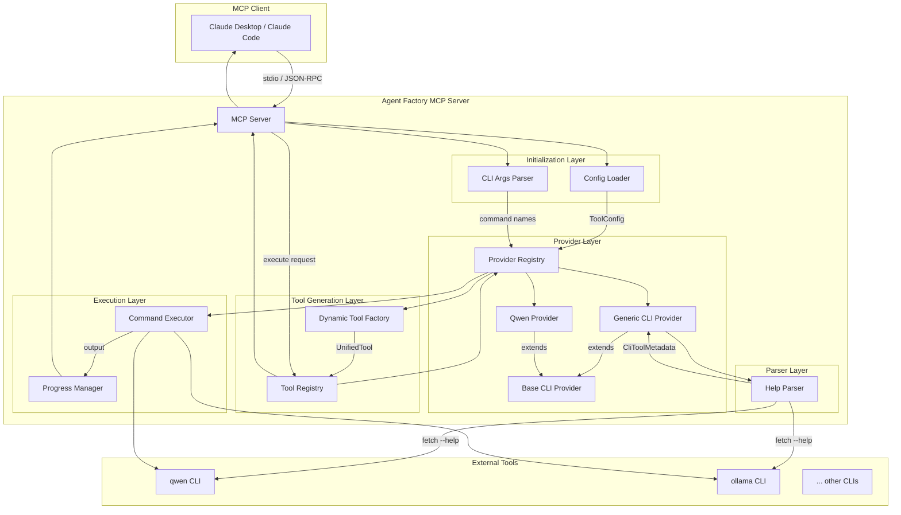
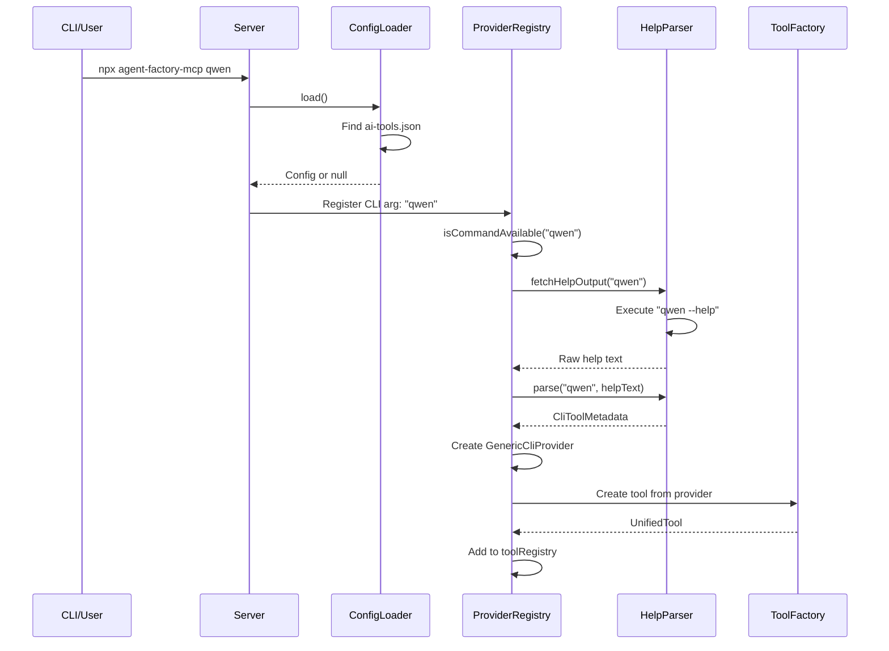
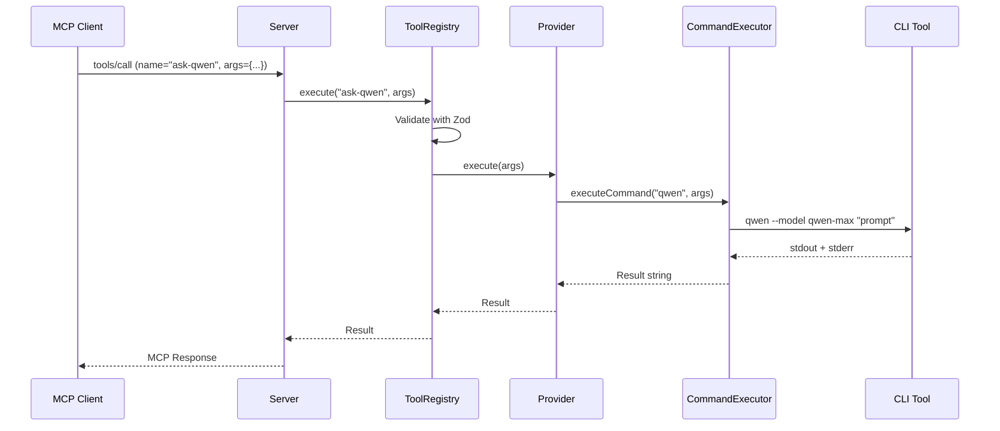

# Architecture

This document describes the architecture of **Agent Factory MCP**, a universal MCP server for CLI tool auto-discovery and AI agent management.

## Overview

Agent Factory MCP transforms any CLI tool into an MCP tool through automatic metadata extraction from `--help` output. The system is built on a provider-based architecture that enables zero-code registration of AI CLI tools.

## Core Concepts

### MCP (Model Context Protocol)
A protocol for AI assistants to communicate with external tools and data sources. Agent Factory MCP implements both the **tools** and **prompts** interfaces.

### Provider Pattern
Each CLI tool is represented by a provider that implements the `AIProvider` interface. Providers are responsible for:
- Executing the CLI command
- Providing metadata about the tool's capabilities
- Handling command-specific arguments and options

### Metadata-Driven Tool Generation
Tool definitions are generated dynamically from `CliToolMetadata`, which is extracted from CLI help output or defined in configuration files.

## System Architecture



## Component Details

### 1. Server Layer (`src/index.ts`)

The MCP server entry point that:
- Initializes from configuration files and CLI arguments
- Handles MCP protocol requests (tools/list, tools/call)
- Manages server lifecycle

**Key responsibilities:**
- Load tools from `ai-tools.json` configuration
- Parse CLI arguments for tool registration
- Route MCP requests to appropriate handlers

### 2. Provider Layer (`src/providers/`)

#### AIProvider Interface
```typescript
interface AIProvider {
  getMetadata(): CliToolMetadata;
  execute(args: Record<string, any>): Promise<string>;
}
```

#### BaseCliProvider
Abstract base class providing:
- Command execution infrastructure
- Progress reporting
- Error handling

#### GenericCliProvider
Auto-discovers CLI tools by:
1. Checking command availability via `which`
2. Fetching `--help` output
3. Parsing with `HelpParser`
4. Generating `CliToolMetadata`

#### QwenProvider
Specialized provider for Qwen CLI with custom metadata.

### 3. Parser Layer (`src/parsers/`)

#### HelpParser
Extracts structured metadata from CLI help text:

**Input:** Raw `--help` output
```
Usage: qwen [options] [query]

Options:
  -m, --model <model>     Model to use
  -p, --prompt <prompt>   Prompt to execute
  -v, --verbose           Verbose output
```

**Output:** `CliToolMetadata`
```typescript
{
  toolName: "ask-qwen",
  command: "qwen",
  description: "...",
  options: [
    { name: "model", flag: "-m", type: "string", ... },
    { name: "prompt", flag: "-p", type: "string", ... },
    { name: "verbose", flag: "-v", type: "boolean", ... }
  ]
}
```

**Regex patterns:**
- Option detection: `/^\s*(?:(-[a-zA-Z]),\s+)?(--[a-zA-Z0-9-]+)\s+(.*)$/`
- Type hints: `/\[boolean\]|\[string\]|\[number\]/`
- Defaults: `/\[default:\s*([^\]]+)\]/`

### 4. Tool Generation Layer (`src/tools/`)

#### DynamicToolFactory
Converts providers to MCP tools:

```typescript
static createTool(provider: AIProvider): UnifiedTool {
  const metadata = provider.getMetadata();
  return {
    name: metadata.toolName,
    description: metadata.description,
    zodSchema: createZodSchema(metadata),
    execute: (args) => provider.execute(args)
  };
}
```

#### Tool Registry
Central registry for all MCP tools with:
- Tool registration
- Tool lookup
- Tool execution with validation

### 5. Configuration Layer (`src/utils/`)

#### ConfigLoader
Loads and validates `ai-tools.json`:

**Config file locations (priority order):**
1. `ai-tools.json`
2. `.qwencoderc.json`
3. `qwencode.config.json`

**Schema validation** using Zod:
```typescript
{
  command: string,           // Required
  enabled?: boolean,         // Default: true
  alias?: string,            // Default: "ask-{command}"
  description?: string,
  systemPrompt?: string,
  providerType?: "cli-auto" | "custom",
  defaultArgs?: Record<string, any>
}
```

### 6. Execution Layer (`src/utils/`)

#### CommandExecutor
Executes CLI commands with:
- Timeout handling
- stdout/stderr capture
- Exit code checking

#### ProgressManager
Provides real-time progress updates via MCP notifications.

## Data Flow

### Tool Registration Flow



### Tool Execution Flow



## Configuration Modes

### Mode 1: Configuration File

```json
{
  "tools": [
    {
      "command": "qwen",
      "alias": "code-reviewer",
      "systemPrompt": "You are a code reviewer..."
    }
  ]
}
```

**Flow:** ConfigLoader → GenericCliProvider → ToolRegistry

### Mode 2: CLI Arguments

```bash
npx agent-factory-mcp qwen gemini aider
```

**Flow:** CLI Parser → GenericCliProvider × 3 → ToolRegistry

### Mode 3: Runtime Registration

```
register_cli_tool({ command: "ollama", persist: true })
```

**Flow:** MCP Request → registerCliToolTool → GenericCliProvider → ConfigLoader.addTool()

## Type System

### Core Types

```typescript
// Tool metadata extracted from CLI
interface CliToolMetadata {
  toolName: string;
  description: string;
  command: string;
  toolType: "simple" | "with-subcommands";
  options: CliOption[];
  argument?: CliArgument;
  subcommands?: SubcommandDefinition[];
  systemPrompt?: string;
}

// CLI option definition
interface CliOption {
  name: string;
  flag: string;
  type: "string" | "number" | "boolean" | "file";
  description: string;
  defaultValue?: string | number | boolean;
  choices?: (string | number)[];
}

// Configuration for tool registration
type ToolConfig = {
  command: string;
  enabled?: boolean;
  alias?: string;
  description?: string;
  systemPrompt?: string;
  providerType?: "cli-auto" | "custom";
  defaultArgs?: Record<string, any>;
};
```

## Extension Points

### Adding a Custom Provider

```typescript
import { BaseCliProvider } from "./base-cli.provider.js";

export class CustomProvider extends BaseCliProvider {
  static async create(config: ToolConfig): Promise<CustomProvider | null> {
    // Custom initialization logic
    return new CustomProvider(metadata);
  }

  override async execute(args: Record<string, any>): Promise<string> {
    // Custom execution logic
    return result;
  }
}
```

### Custom Parser Strategy

```typescript
// For non-standard help formats
class CustomParser {
  static parse(command: string, helpOutput: string): CliToolMetadata {
    // Custom parsing logic
  }
}
```

## Error Handling

### Graceful Degradation

1. **Missing CLI Tool**: Skip registration, log warning
2. **Invalid Config**: Log error, use defaults
3. **Parse Failure**: Fall back to minimal metadata
4. **Execution Failure**: Return error message to MCP client

### Logging

- Debug: Detailed flow information
- Info: Tool registrations, configuration loads
- Warn: Missing tools, invalid configs
- Error: Execution failures

## Security Considerations

- **Command Injection**: All arguments validated and escaped
- **Path Traversal**: Config files restricted to project directory
- **Arbitrary Execution**: Only registered commands can be executed
- **Environment Variables**: Configurable per-tool via `env` field

## Performance

- **Lazy Initialization**: Providers created only when needed
- **Command Availability Check**: Cached after first check
- **Help Output Parsing**: Done once per tool at startup
- **Progress Streaming**: Real-time output for long-running commands
